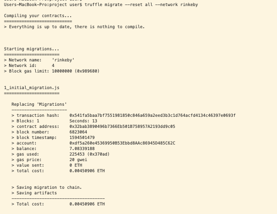
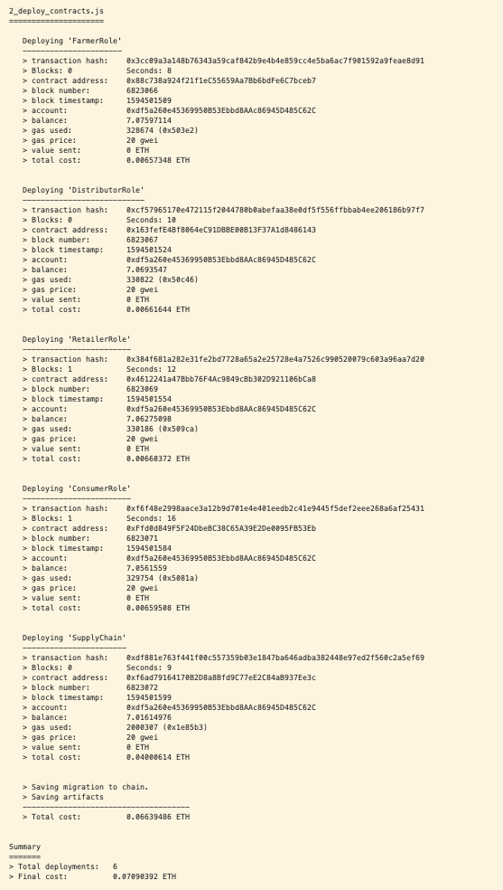
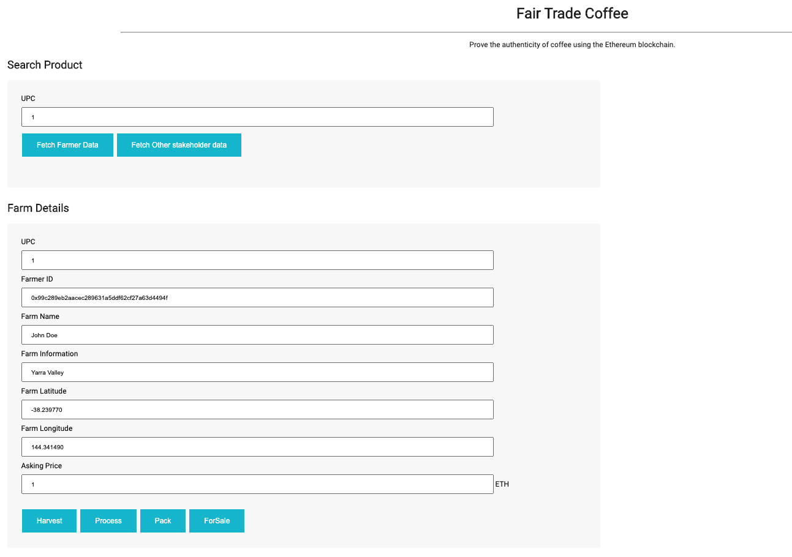
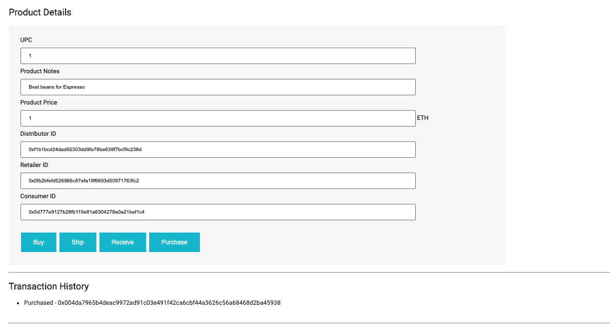

# Supply chain & data auditing

Deployed Contracts on Rinkeby: 

Supply Chain: 0xf6ad79164170b2d8a8bfd9c77ee2c84ab937ee3c - https://rinkeby.etherscan.io/address/0xf6ad79164170b2d8a8bfd9c77ee2c84ab937ee3c
Consumer Role: 0xFfd0d849F5F24DbeBC38C65A39E2De0095FB53Eb - https://rinkeby.etherscan.io/address/0xffd0d849f5f24dbebc38c65a39e2de0095fb53eb
Retailer Role: 0x4612241a47Bbb76F4Ac9849cBb302D921106bCa8 - https://rinkeby.etherscan.io/address/0x4612241a47bbb76f4ac9849cbb302d921106bca8
Distributor Role: 0x163fefE4Bf8064eC91DBBE00B13F37A1d8486143 - https://rinkeby.etherscan.io/address/0x163fefe4bf8064ec91dbbe00b13f37a1d8486143
Farmer Role: 0x88c738a924f21f1eC55659Aa7Bb6bdFe6C7bceb7 - https://rinkeby.etherscan.io/address/0x88c738a924f21f1eC55659Aa7Bb6bdFe6C7bceb7


Example of what it should look when you run ```truffle mgirate --reset all --network rinkeby```




This repository containts an Ethereum DApp that demonstrates a Supply Chain flow between a Seller and Buyer. The user story is similar to any commonly used supply chain process. A Seller can add items to the inventory system stored in the blockchain. A Buyer can purchase such items from the inventory system. Additionally a Seller can mark an item as Shipped, and similarly a Buyer can mark an item as Received.

The DApp User Interface when running should look like...






## Getting Started

These instructions will get you a copy of the project up and running on your local machine for development and testing purposes. See deployment for notes on how to deploy the project on a live system.

### Prerequisites

Please make sure you've already installed ganache-cli, Truffle and enabled MetaMask extension in your browser.

```
Give examples (to be clarified)
```

### Installing

A step by step series of examples that tell you have to get a development env running

Clone this repository:

```
git clone https://github.com/udacity/nd1309/tree/master/course-5/project-6
```

Change directory to ```project-6``` folder and install all requisite npm packages (as listed in ```package.json```):

```
cd project-6
npm install
```

Launch Ganache:

```
ganache-cli -m "spirit supply whale amount human item harsh scare congress discover talent hamster"
```

Your terminal should look something like this:


In a separate terminal window, Compile smart contracts:

```
truffle compile
```

Your terminal should look something like this:


This will create the smart contract artifacts in folder ```build\contracts```.

Migrate smart contracts to the locally running blockchain, ganache-cli:

```
truffle migrate
```

Your terminal should look something like this:


Test smart contracts:

```
truffle test
```

All 10 tests should pass.


In a separate terminal window, launch the DApp:

```
npm run dev
```

## Built With

* [Ethereum](https://www.ethereum.org/) - Ethereum is a decentralized platform that runs smart contracts
* [IPFS](https://ipfs.io/) - IPFS is the Distributed Web | A peer-to-peer hypermedia protocol
to make the web faster, safer, and more open.
* [Truffle Framework](http://truffleframework.com/) - Truffle is the most popular development framework for Ethereum with a mission to make your life a whole lot easier.


## Authors

See also the list of [contributors](https://github.com/your/project/contributors.md) who participated in this project.

## Acknowledgments

* Solidity
* Ganache-cli
* Truffle
* IPFS
