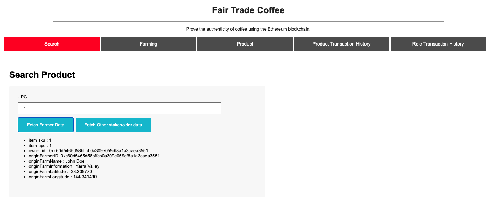
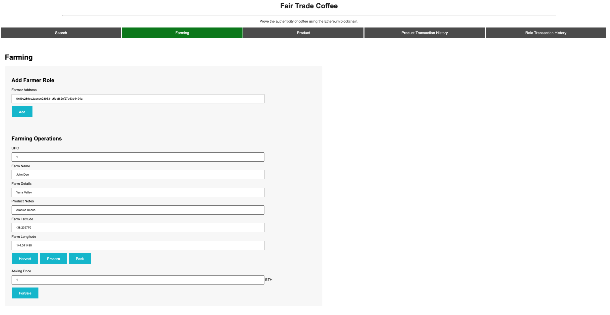
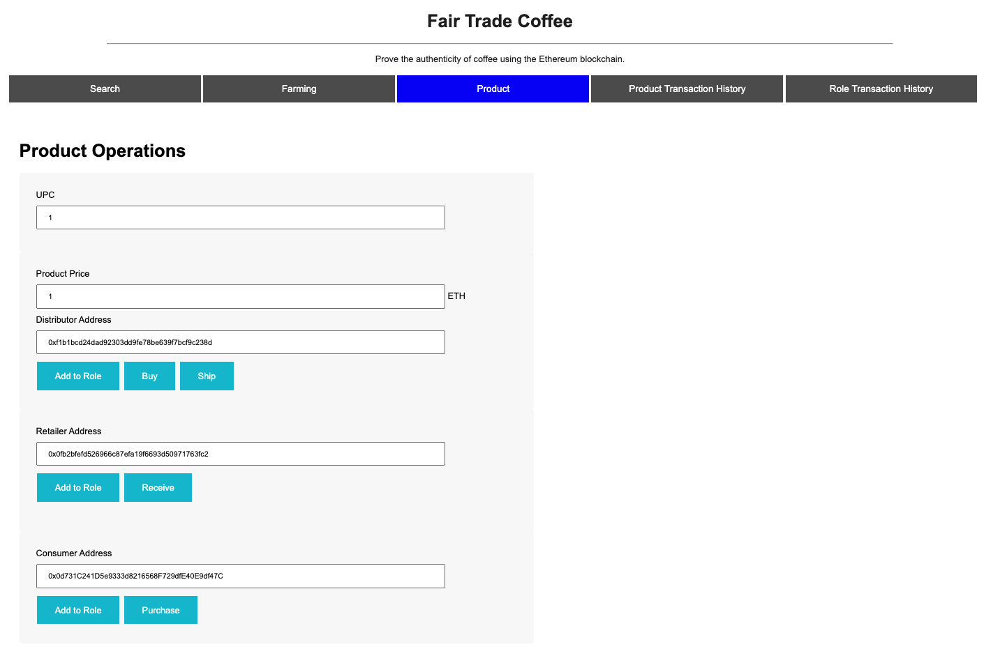
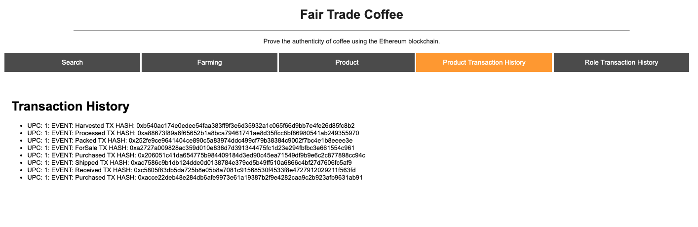
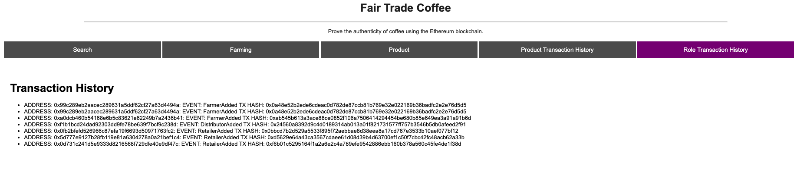

# Supply chain & data auditing

This project is an Ethereum DApp implementing supply chain management and auditing. It will track and record the lifecycle of items on the Ethereum Blockchain; from the time it is harvested, all the way to when a consumer purchases the item. 
 

## Role Based Access Control
The supply chain smart contract applies Role Based Access Control(RBAC); only certain accounts are granted permisiions to perform certain operations. For example, only an account address which is assigned the Farmer Role will be able to harvest and pack the item. An account address which is assigned the role of a Consumer will not be able to harvest items but only purchase them.

Once an account address has access to certain role, they can assign the same role to another account addresses. 
By default, the account address that deploys the contracts inherits all of the roles and thus is able to assign other account addresses with certain roles. 

## Getting Started

These instructions will get you a copy of the project up and running on your local machine for development and testing purposes. See deployment section  on how to deploy the project on the rinkeby network.


### Installing

A step by step series of examples that tell you have to get a development env running

Clone this repository:

```
git clone https://github.com/ammarqureshi/SupplyChainManagement.git
```

Install packages listed in 'package.json'
```
cd project
npm install
```

Launch Truffle Develop environment, which will spawn a local development blockchain on port 9545 by default. If you already have a truffle develop session running, it will instead connect to that development blockchain.

```
truffle develop
```

Compile smart contracts:

```
truffle compile
```

This will create the smart contract artifacts under folder ```build\contracts```

Migrate smart contracts to the locally running blockchain:

```
truffle migrate --reset all
```

Test smart contracts:

```
truffle test
```

Launch the DApp frontent by :

```
cd project
npm run dev
```

The DApp Frontend: 








## UML Diagrams
You can find activity, class, sequence and state diagrams in the UML folder. 
### Activity Diagram


### Sequence Diagram


### State Diagram


### Class Diagram


## Deploying to Rinkeby: 
Once the smart contracts are compiled and the tests run successfully, you can deploy the smart contracts to a test network such as Rinkeby

In 'truffle.js' file, pass in your mnemonic and your infura api key into HDWalletProvider and run:

```truffle mgirate --reset all --network rinkeby```

You should have something similar once truffle is able to deploy the contracts successfully: 


## Deployments on Rinkeby: 

Migrations: 0xb6f51A630f46284467b4c340E574e9d6d2e3C411 - https://rinkeby.etherscan.io/address/0xb6f51a630f46284467b4c340e574e9d6d2e3c411

Farmer Role: 0x6fC5533fB0E0A211768e0144DB4F714e1d20ab97 - https://rinkeby.etherscan.io/address/0x6fC5533fB0E0A211768e0144DB4F714e1d20ab97

Distributor Role: 0x778f18CC43489826188c3Ec858799006Daf7D8bd - https://rinkeby.etherscan.io/address/0x778f18CC43489826188c3Ec858799006Daf7D8bd

Retailer Role: 0x1E5bd0138a88ABC90767e12eB5cc9D0E313033B3 - https://rinkeby.etherscan.io/address/0x1E5bd0138a88ABC90767e12eB5cc9D0E313033B3

Consumer Role: 0x9941C627fA64A1eb9138239056C21f5D389A3F84 - https://rinkeby.etherscan.io/address/0x9941c627fa64a1eb9138239056c21f5d389a3f84

Supply Chain: 0x619F32dD07B5b2d77Be77DaBe0b991641C47a18E - https://rinkeby.etherscan.io/address/0x619f32dd07b5b2d77be77dabe0b991641c47a18e


## Built With

* [Ethereum](https://www.ethereum.org/) - Ethereum is a decentralized platform that runs smart contracts
* [Truffle Framework](http://truffleframework.com/) - Truffle is the most popular development framework for Ethereum with a mission to make your life a whole lot easier.


* Solidity
* Ganache-cli
* Truffle
* IPFS
