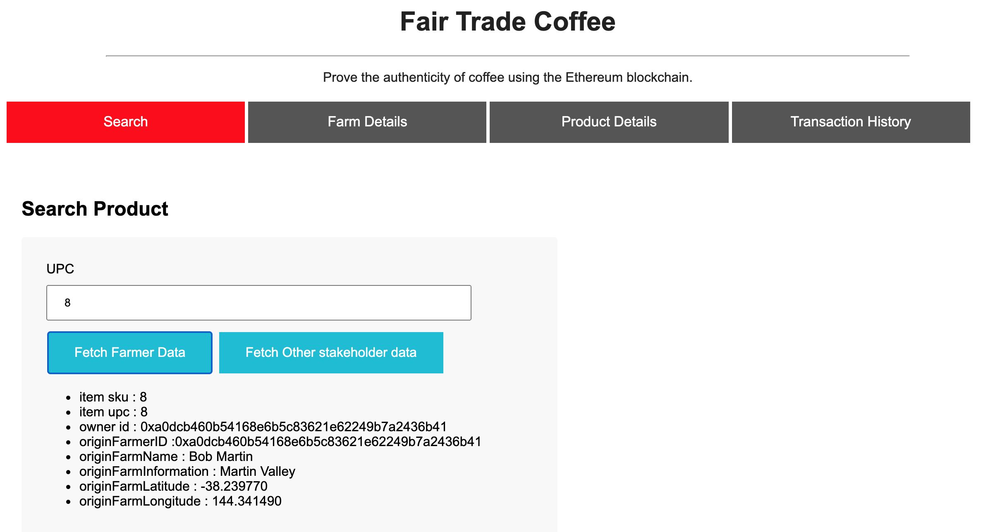
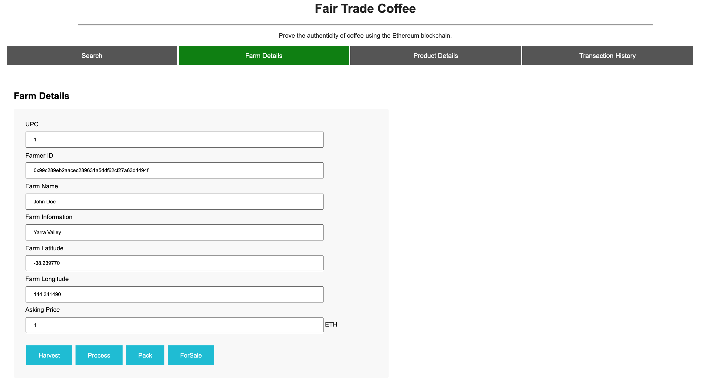
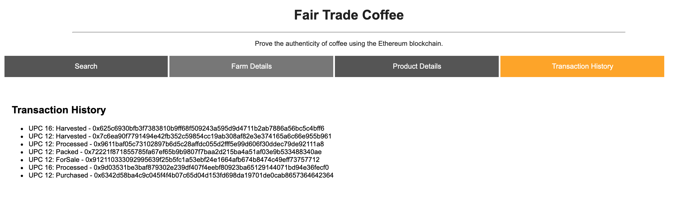

# Supply chain & data auditing

## Deployed Contracts on Rinkeby: 

Migrations: 0xb6f51A630f46284467b4c340E574e9d6d2e3C411 - https://rinkeby.etherscan.io/address/0xb6f51a630f46284467b4c340e574e9d6d2e3c411

Farmer Role: 0x6fC5533fB0E0A211768e0144DB4F714e1d20ab97 - https://rinkeby.etherscan.io/address/0x6fC5533fB0E0A211768e0144DB4F714e1d20ab97

Distributor Role: 0x778f18CC43489826188c3Ec858799006Daf7D8bd - https://rinkeby.etherscan.io/address/0x778f18CC43489826188c3Ec858799006Daf7D8bd

Retailer Role: 0x1E5bd0138a88ABC90767e12eB5cc9D0E313033B3 - https://rinkeby.etherscan.io/address/0x1E5bd0138a88ABC90767e12eB5cc9D0E313033B3

Consumer Role: 0x9941C627fA64A1eb9138239056C21f5D389A3F84 - https://rinkeby.etherscan.io/address/0x9941c627fa64a1eb9138239056c21f5d389a3f84

Supply Chain: 0x619F32dD07B5b2d77Be77DaBe0b991641C47a18E - https://rinkeby.etherscan.io/address/0x619f32dd07b5b2d77be77dabe0b991641c47a18e


Example of what it should look when you run ```truffle mgirate --reset all --network rinkeby```


This repository containts an Ethereum DApp that demonstrates a Supply Chain flow between a Seller and Buyer. The user story is similar to any commonly used supply chain process. A Seller can add items to the inventory system stored in the blockchain. A Buyer can purchase such items from the inventory system. Additionally a Seller can mark an item as Shipped, and similarly a Buyer can mark an item as Received.

The DApp User Interface when running should look like...







## UML Diagrams
You can find activity, class, sequence and state diagrams in the UML folder. 
### Activity Diagram


### Sequence Diagram


### State Diagram


### Class Diagram


## Getting Started

These instructions will get you a copy of the project up and running on your local machine for development and testing purposes. See deployment for notes on how to deploy the project on a live system.


### Installing

A step by step series of examples that tell you have to get a development env running

Clone this repository:

```
git clone https://github.com/udacity/nd1309/tree/master/course-5/project-6
```

Change directory to ```project``` folder and install all requisite npm packages (as listed in ```package.json```):

```
cd project
npm install
```

Launch Ganache:

```
ganache-cli -m "spirit supply whale amount human item harsh scare congress discover talent hamster"
```

Your terminal should look something like this:


In a separate terminal window, Compile smart contracts:

```
truffle compile
```

Your terminal should look something like this:


This will create the smart contract artifacts in folder ```build\contracts```.

Migrate smart contracts to the locally running blockchain, ganache-cli:

```
truffle migrate
```

Your terminal should look something like this:


Test smart contracts:

```
truffle test
```

All 10 tests should pass.


In a separate terminal window, launch the DApp:

```
npm run dev
```

## Built With

* [Ethereum](https://www.ethereum.org/) - Ethereum is a decentralized platform that runs smart contracts
* [Truffle Framework](http://truffleframework.com/) - Truffle is the most popular development framework for Ethereum with a mission to make your life a whole lot easier.


* Solidity
* Ganache-cli
* Truffle
* IPFS
